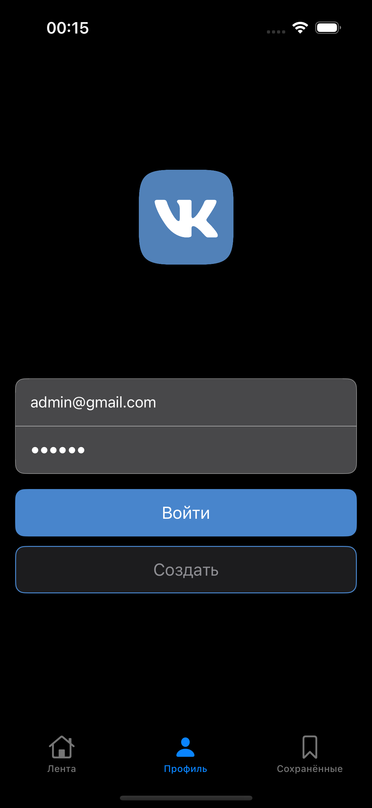
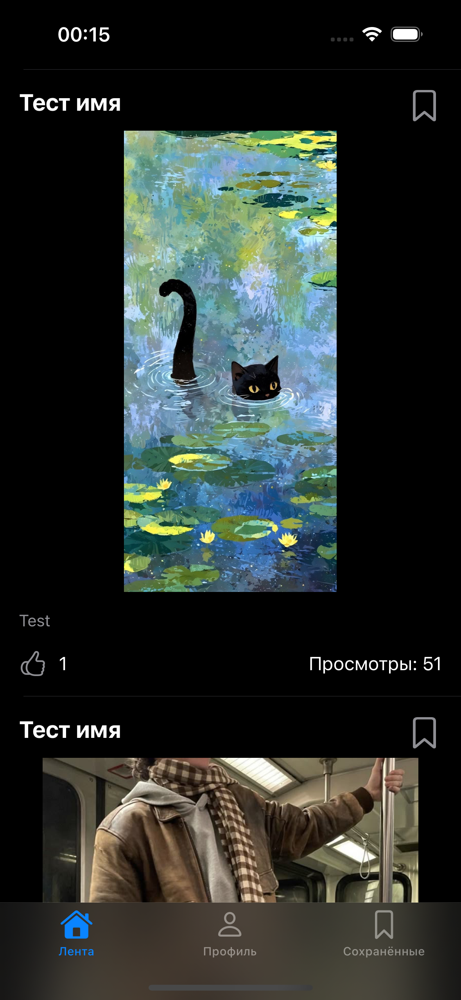
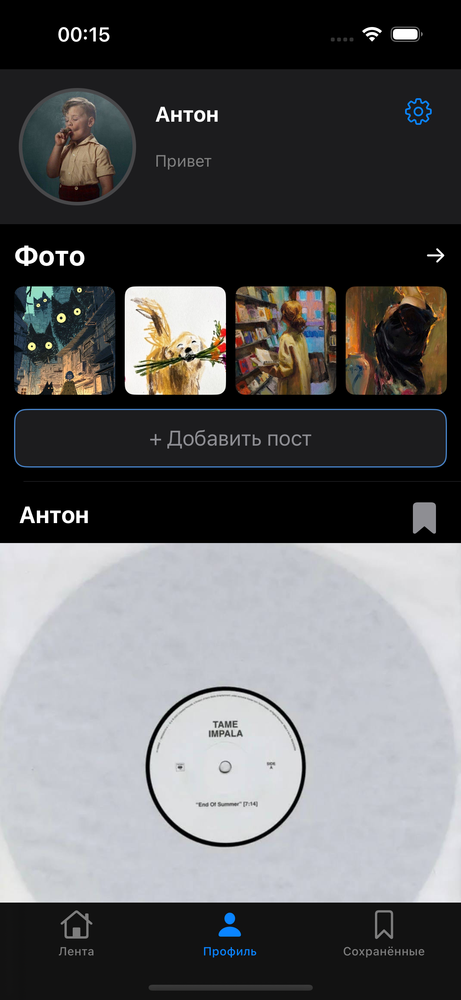
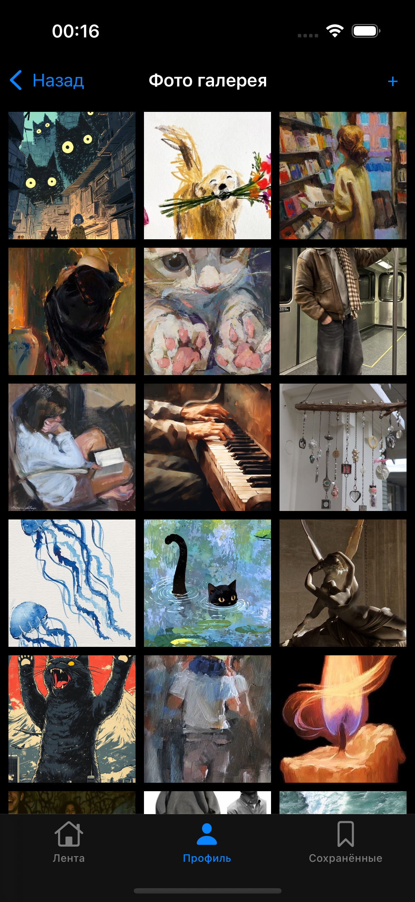
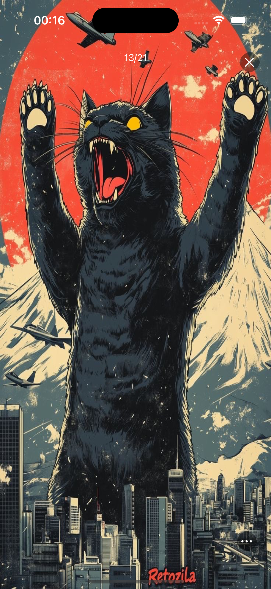
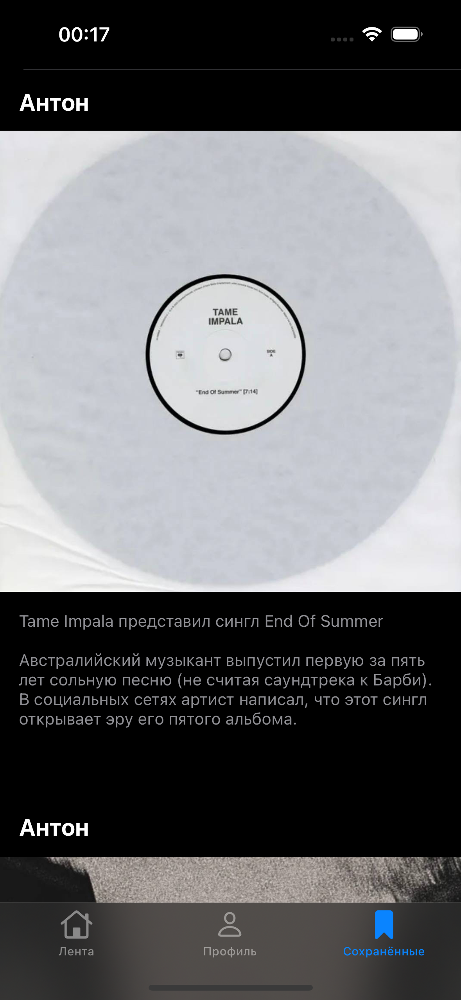

# Navigation iOS App

iOS приложение, реализующее функционал небольшой социальной сети: лента постов, профиль пользователя, загрузка фотографий, авторизация и сохранение постов.

Приложение построено на архитектуре **Coordinator + MVVM**, использует **Firebase** для бэкенда и **Realm** для локального хранения.

---

# Features

### Авторизация

* Login через email и password
* Регистрация пользователя
* Обработка ошибок авторизации
* Автоматический вход если пользователь уже авторизован

### Лента постов

* Просмотр списка постов
* Лайки постов
* Увеличение счетчика просмотров
* Сохранение постов в закладки

### Профиль пользователя

* Просмотр информации о пользователе
* Изменение статуса
* Загрузка и изменение аватара
* Просмотр галереи пользователя

### Галерея

* Загрузка изображений
* Просмотр изображений
* Полноэкранный режим
* Установка изображения как аватар
* Удаление изображения

### Сохраненные посты

* Локальное хранение через Realm
* Удаление постов свайпом

---

# Screenshots

| Login      | Feed       | Profile    |
| ---------- | ---------- | ---------- |
|  |  |  |

| Gallery    | Full Screen | Saved Posts |
| ---------- | ----------- | ----------- |
|  |   |   |


---

# Architecture

Проект построен на архитектуре:

**Coordinator + MVVM**

## Coordinator

Coordinator отвечает за навигацию между экранами.

Используются следующие координаторы:

* `MainCoordinator`
* `FeedCoordinator`
* `LogInCoordinator`

Навигация запускается из:

```
SceneDelegate
```

```
SceneDelegate
    ↓
MainCoordinator
    ↓
TabBarController
    ├── Feed
    ├── Profile/Login
    └── Saved Posts
```

---

## MVVM

Каждый экран использует `ViewModel`.

Примеры:

```
FeedViewController → FeedViewModel
ProfileViewController → ProfileViewModel
LogInViewController → LoginViewModel
PhotosViewController → PhotosViewModel
SavedPostTableViewController → SavedPostViewModel
```

ViewModel отвечает за:

* загрузку данных
* работу с сервисами
* обновление UI через callbacks

---

# Technologies

Проект использует:

* UIKit
* MVVM
* Coordinator pattern
* Firebase Auth
* Firebase Firestore
* Realm
* Kingfisher (загрузка изображений)
* ImgBB API (хранение изображений)

---

# Main Components

### Feed

```
FeedViewController
FeedViewModel
PostTableViewCell
```

Функции:

* загрузка постов
* лайки
* просмотры
* сохранение постов

---

### Profile

```
ProfileViewController
ProfileHeaderView
ProfileViewModel
```

Функции:

* отображение профиля
* изменение статуса
* управление аватаром
* список постов пользователя

---

### Photos

```
PhotosViewController
PhotosCollectionViewCell
FullScreenImageViewController
PhotosViewModel
```

Функции:

* галерея изображений
* загрузка изображений
* полноэкранный просмотр
* установка аватара

---

### Authentication

```
LogInViewController
RegistrationViewController
LoginViewModel
```

Функции:

* логин
* регистрация
* обработка ошибок

---

### Saved Posts

```
SavedPostTableViewController
SavedPostViewModel
RealmService
```

Функции:

* сохранение постов
* локальное хранение
* удаление постов

---

# Project Structure

```
Navigation
│
├── Coordinators
│   ├── MainCoordinator
│   ├── FeedCoordinator
│   └── LogInCoordinator
│
├── Controllers
│   ├── FeedViewController
│   ├── ProfileViewController
│   ├── PhotosViewController
│   ├── LogInViewController
│   ├── RegistrationViewController
│   └── SavedPostTableViewController
│
├── ViewModels
│
├── Views
│   ├── PostTableViewCell
│   ├── ProfileHeaderView
│   └── PhotosCollectionViewCell
│
├── Services
│   ├── FirebaseService
│   ├── RealmService
│   └── ImgBBService
│
└── Models
```

---

# Author

Anton Shylin

iOS Developer
